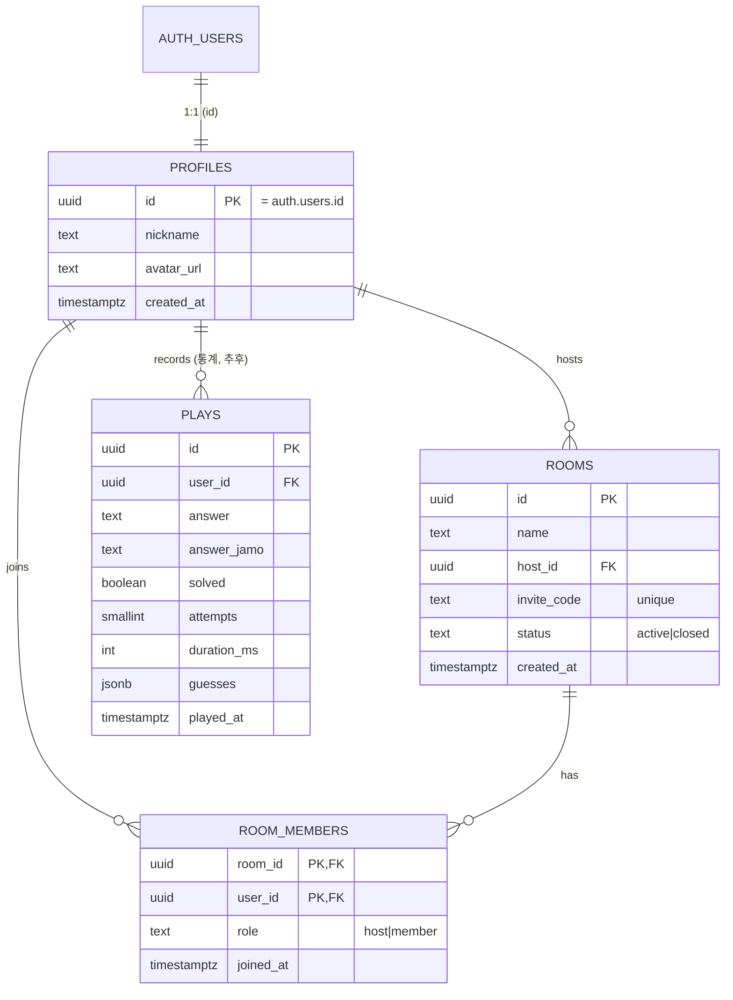

# kordle — 데이터베이스 설계 (ERD)

> DB 스키마·관계·RLS·쿼리 모음. 제품 요구는 [PRD.md](./PRD.md), 진행 체크리스트는 [TODO.md](./TODO.md).
> 인프라: Supabase (Postgres + Auth + RLS). 인증은 카카오 OAuth(`@supabase/ssr`)로 구현 완료.

---

## 1. 현재 상태

| 스키마 | 테이블 | 비고 |
|--------|--------|------|
| `auth` (Supabase 관리) | `users`, `identities`, `sessions` … | 카카오 로그인 유저 저장. **우리가 정의 안 함** |
| `public` (우리 도메인) | **(아직 없음)** | 아래 설계대로 마이그레이션 예정 |

- 카카오 유저는 `auth.users.id`(UUID) + `auth.identities.provider_id`(카카오 회원번호)로 식별. 이메일은 선택(없을 수 있음).
- `public` 도메인 테이블(profiles/rooms/room_members)은 "같이 풀기" 구현 시 생성.

---

## 2. ERD



---

## 3. 테이블 정의

### 3.1 같이 풀기 (방) — 다음 구현 대상

```sql
-- 프로필: auth.users 확장 (카카오 닉네임 표시용)
create table public.profiles (
  id          uuid primary key references auth.users(id) on delete cascade,
  nickname    text not null,
  avatar_url  text,
  created_at  timestamptz not null default now()
);

-- 방: "같이 풀기" 단위 (지속형 그룹)
create table public.rooms (
  id          uuid primary key default gen_random_uuid(),
  name        text not null,
  host_id     uuid not null references public.profiles(id) on delete cascade,
  invite_code text unique,                    -- 참여 코드 (참여 방식 확정 시 사용)
  status      text not null default 'active', -- active | closed
  created_at  timestamptz not null default now()
);

-- 방 참여자 (다대다)
create table public.room_members (
  room_id   uuid references public.rooms(id) on delete cascade,
  user_id   uuid references public.profiles(id) on delete cascade,
  role      text not null default 'member',   -- host | member
  joined_at timestamptz not null default now(),
  primary key (room_id, user_id)
);

create index room_members_user_idx on public.room_members(user_id);
```

### 3.2 통계 (plays) — 클라우드 동기화 시 (추후)

> 현재 통계는 localStorage(`kordle.plays`)에 저장. 아래는 Supabase 승격용. 로컬 필드와 1:1 대응 → 마이그레이션은 로컬 배열 INSERT.

```sql
create table public.plays (
  id           uuid primary key default gen_random_uuid(),
  user_id      uuid not null references auth.users(id) on delete cascade,
  played_at    timestamptz not null default now(),
  answer       text not null,
  answer_jamo  text not null,
  solved       boolean not null,
  attempts     smallint not null check (attempts between 1 and 5),
  duration_ms  int not null,
  guesses      jsonb not null
);

create index plays_user_played_idx on public.plays(user_id, played_at desc);
```

---

## 4. RLS 정책

> ⚠️ **공개 repo + 공개 anon 키**이므로 RLS가 유일한 보안 경계. 모든 테이블 RLS 필수.

```sql
alter table public.profiles     enable row level security;
alter table public.rooms        enable row level security;
alter table public.room_members enable row level security;

-- profiles: 로그인 유저 읽기(멤버 닉네임 표시), 본인만 쓰기
create policy "profiles read"   on public.profiles for select using (auth.role() = 'authenticated');
create policy "profiles insert" on public.profiles for insert with check (auth.uid() = id);
create policy "profiles update" on public.profiles for update using (auth.uid() = id);

-- rooms: 내가 멤버인 방만 읽기, 로그인 유저는 방 생성, host만 수정/삭제
create policy "rooms read members" on public.rooms for select
  using (exists (select 1 from room_members m where m.room_id = id and m.user_id = auth.uid()));
create policy "rooms insert" on public.rooms for insert with check (auth.uid() = host_id);
create policy "rooms host manage" on public.rooms for update using (auth.uid() = host_id);

-- room_members: 같은 방 멤버끼리 읽기, 본인 가입/탈퇴
create policy "members read same room" on public.room_members for select
  using (exists (select 1 from room_members me where me.room_id = room_id and me.user_id = auth.uid()));
create policy "members self join"  on public.room_members for insert with check (auth.uid() = user_id);
create policy "members self leave" on public.room_members for delete using (auth.uid() = user_id);
```

```sql
-- plays (추후): 로그인 유저 읽기(리더보드), 본인만 쓰기
alter table public.plays enable row level security;
create policy "plays read all"   on public.plays for select using (auth.role() = 'authenticated');
create policy "plays insert own" on public.plays for insert with check (auth.uid() = user_id);
```

---

## 5. 핵심 쿼리

**내가 참여중인 방 목록 (방 목록 화면)**

```sql
select r.*, (select count(*) from room_members m2 where m2.room_id = r.id) as member_count
from rooms r
join room_members m on m.room_id = r.id
where m.user_id = auth.uid()
order by r.created_at desc;
```

---

## 6. 마이그레이션 주의사항

- **RLS 무한 재귀**: `rooms read`/`room_members read` 정책이 서로를 참조하면 재귀 위험.
  → `security definer` 헬퍼 함수(예: `is_room_member(room_id, uid)`)로 우회하거나 정책 단순화. 마이그레이션 단계에서 반드시 검증.
- **방 생성 원자성**: `rooms` insert + 생성자를 `room_members`(role=host) insert를 한 트랜잭션으로.
  → `create_room(name)` RPC(함수) 권장. 클라 2-step은 중간 실패 시 host 없는 방 발생 위험.
- **프로필 자동 생성**: 첫 로그인 시 `auth.users` → `public.profiles` upsert.
  → DB trigger `on insert on auth.users` 또는 `/auth/callback`에서 upsert.
- **스키마 = 코드**: 모든 변경은 `supabase/migrations/*.sql`로 남겨 버전관리. MCP `apply_migration` 사용 시에도 동일 SQL을 repo에 커밋.
